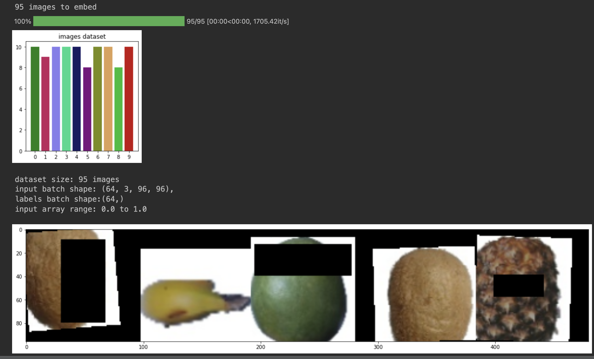

# TensorFlow Keras custom data generator

This repository represents custom data generator in TensorFlow and 
supporting data preparation functions

## Installation
### Requirements
To install run:
```bash
$ pip install -r requirements.txt
```

## Data Preparation

### Download
Dwonload and move fruits/ folder in project directory
```bash
$ git clone https://github.com/somesh-scoville/datasets
```

### Prepare dataset
```bash
$ python3 prepare_dataset.py
```

### Generate and Test data generator
```bash
$ python3 data_generator.py
```


